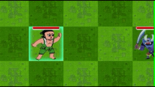
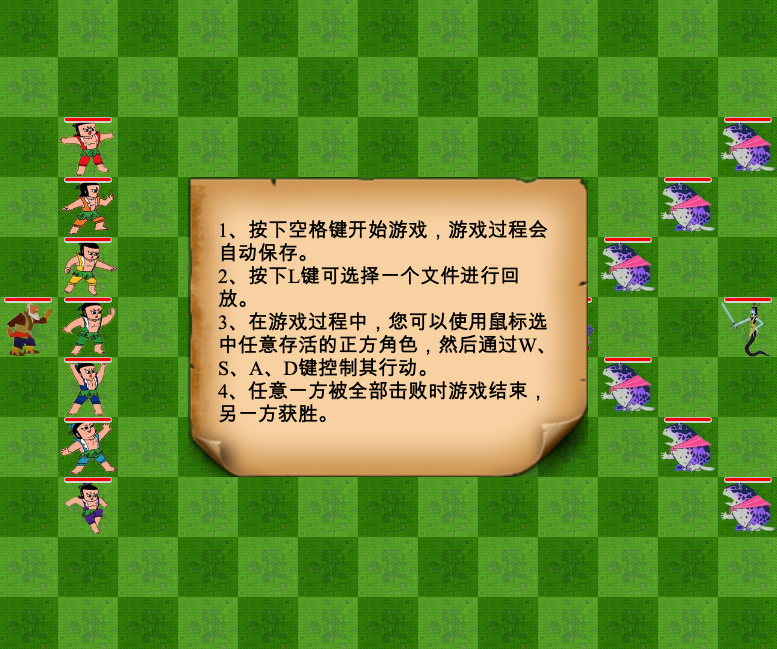

# CalabashMan
该项目是[java-2018f课程](https://github.com/njuics/app-2018f)的[大作业](https://github.com/njuics/java-2018f-homework/tree/master/Final%20Project)，使用JavaFX开发一个葫芦娃大战妖精的应用。

本页面含有4张gif图片与若干png图片，共8MB，可能需要较长的加载时间。

## 测试环境

## 主要特性
1、动画效果
- 不同于直接修改坐标使人物“瞬移”，使用AnimationTimer实现了人物的平滑移动(GIF)


- 当人物的上、下、左、右任一方向有敌军的时候，人物会进入战斗状态(GIF)



2、用户交互

- 用户可以使用鼠标、键盘控制正方人物的移动。多个葫芦娃同时攻击一个敌人能以更小的代价消灭对方

- 游戏开始前会有操作提示(PNG)



- 画面上方以弹窗的形式通报当前游戏状态(GIF)


3、其他
- 赋予蛇精一个额外的技能(模仿自[安琪拉](https://pvp.qq.com/web201605/herodetail/142.shtml))，每20秒有50%的几率触发。该技能威力较大，因此正方应尽快消灭蛇精。

4、完整流程(GIF,约5MB)


## 系统框架
1、模块简介

|包名|功能|
|---|---|
|**app**|JavaFx主类模块，定义app主循环|
|**creature**|生物体控制器模块，定义战场上所有生物体的属性与功能|
|**field**|战场控制器模块，定义战场的属性与功能|
|**notificat**|通知模块，定义顶部通知与屏幕中央的用户提示|
|**ui**|UI模块，定义多种sprite和图片资源加载器|
|**control**|操作模块，定义用户操作与系统操作，用于回放|
|**io**|I/O模块，用于游戏存档与回放|

2、creature模块
3、io模块

## 设计思路
1、设计模式
- 单例模式：爷爷、蛇精、蝎子精三个类实际上都只对应于单一实体，由于其他功能限制此处没有使用枚举类型定义，但通过单例模式防止生成多个对象。基于相同的理由，葫芦娃、喽啰也采用了类似的模式，但在调用`getInstance()`时需要用一个参数指明具体对象的索引。在具体实现上，采用了线程安全的方法：
```java
public static GrandFather getInstance() {
    if (gf == null) {
        synchronized (GrandFather.class) {
            if (gf == null) {
                gf = new GrandFather(ImageLoader.getImage("GrandFather"), "爷爷");
            }
        }
    }
    return gf;
}
```
## 游戏回放
游戏回放模块选用XML作为存储文件格式。在一局游戏中，局势主要由玩家操作与随机释放的技能决定，因此回放文件存储了所有用户操作与随机数结果。具体而言，在control模块中定义了`Abstract class Action`，由此具体实现了键盘操作`KeyboardAction`、鼠标操作`MouseAction`和技能释放操作（实际上由随机数操控）`SkillAction`，最终将游戏过程抽象为`List<Action>`并存储在XML文件中。
文件样例：
```xml
<?xml version="1.0" encoding="UTF-8" standalone="no"?>
<game>
    <action>
        <type>MOUSE</type>
        <time>582575441</time>
        <x>100</x>
        <y>329</y>
    </action>
    <action>
        <type>KEYBOARD</type>
        <time>731265155</time>
        <keycode>D</keycode>
    </action>
    <action>
        <type>SKILL</type>
        <time>20120217225</time>
    </action>
</game>
```

## 参考资料 & 素材来源
1、[Introduction to JavaFX for Game Development](https://gamedevelopment.tutsplus.com/tutorials/introduction-to-javafx-for-game-development--cms-23835)

2、[How to read and write xml files?](https://stackoverflow.com/a/7373596)

3、素材来源：[草地](http://www.aigei.com/view/70730.html)、[葫芦娃](http://4-designer.com/2015/07/Gourd-vector/)、[爷爷](https://pbs.twimg.com/profile_images/660505972331286528/pHP1O-Nx_400x400.jpg)、[蛇精技能火柱](https://www.ae256.com/bj/1861410545715.html)、[蛇精/蝎子精](http://game.joyme.com/hlw_1/article/113180)、[喽啰](https://www.wukong.com/answer/6526823921885380871/)