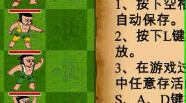

# CalabashMan

该项目是[java-2018f课程](https://github.com/njuics/app-2018f)的[大作业](https://github.com/njuics/java-2018f-homework/tree/master/Final%20Project)，使用JavaFX开发一个葫芦娃大战妖精的应用。

本页面含有4张gif图片与若干png图片，共8MB，可能需要较长的加载时间。

## 运行

```shell
mvn package
java -jar target/[JAR_FILE]
```


## 测试环境

- JDK 1.8.0_191
- Maven 3.3.9
- JUnit 5.3.2

## 主要特性
1、动画效果
- 不同于直接修改坐标使人物“瞬移”，使用AnimationTimer实现了人物的平滑移动(GIF)


- 当人物的上、下、左、右任一方向有敌军的时候，人物会进入战斗状态(GIF)


2、用户交互

- 用户可以使用鼠标、键盘控制正方人物的移动。多个葫芦娃同时攻击一个敌人能以更小的代价消灭对方

- 游戏开始前会有操作提示(PNG)


- 画面上方以弹窗的形式通报当前游戏状态(GIF)


3、其他
- 赋予蛇精一个额外的技能(模仿自[安琪拉](https://pvp.qq.com/web201605/herodetail/142.shtml))，每20秒有50%的几率触发。该技能威力较大，因此正方应尽快消灭蛇精。

4、完整流程(GIF,约5MB)

该回放所用文件即为`CalabashMan/record.xml`。


## 系统框架
1、模块简介

|包名|功能|
|---|---|
|**app**|JavaFx主类模块，定义app主循环|
|**creature**|生物体控制器模块，定义战场上所有生物体的属性与功能|
|**field**|战场控制器模块，定义战场的属性与功能|
|**notification**|通知模块，定义顶部通知与屏幕中央的用户提示|
|**ui**|UI模块，定义多种sprite和图片资源加载器|
|**control**|操作模块，定义用户操作与系统操作，用于回放|
|**io**|I/O模块，用于游戏存档与回放|

2、模块联系
- app模块控制整个系统的主循环，其中的class Main最先被创建，其他模块都从这里开始直接或间接地被实例化。
- creature、field和notification几个模块分别表示用户能看到的生物体、战场和通知，但这它们并不关注ui的细节，而是直接使用ui模块中封装好的如CreatureSprite等各种UI元素。creature等模块只关注实体的行为和部分属性，并作为联系io与ui的桥梁。此处的实现尽量遵循MVC模式。
- control和io模块主要提供数据持久化保存的服务。其中，control定义了几种能影响游戏局势的Action，io模块负责这些Action的读写操作。

3、creature模块

该模块的结构如下：


- 所有的生物体都继承于Creature抽象类。Creature类中定义了生物体所共有的属性和行为，如名字、外观(即CreatureSprite)、移动操作等。
- 由于该游戏的方案是人机对战，因此将Creature细分为PCCreature和PlayerCreature，其中前者“自动移动，用户不可操作”，后者“不自动移动，用户可操作”。
- 对于PCCreature和PlayerCreature，又细分为葫芦娃、蛇精等具体的人物类。为了遵循现实规律，这些类都以单例模式(或类似)实现，后文会展开说明。

3、io模块

- 由于存储文件选择了XML格式(后文有详细介绍)，io部分选择以DOM的方式读写。读操作的核心代码如下，写操作与此类似：

```java
List<Action> actions = new ArrayList<>();
DocumentBuilderFactory dbf = DocumentBuilderFactory.newInstance();
DocumentBuilder db = dbf.newDocumentBuilder();
Document document = db.parse(file);

NodeList actionNodeList = document.getDocumentElement().getElementsByTagName("action");
//由此开始，判断每个Action的类型并存储
```

4、ui模块
- ui模块主要设计了不同对象在屏幕上的外观，并封装好接口提供给控制器类调用。如，CreatruSprite中定义了人物的形象和血条等素材，由于血条是跟随人物的，因此该类提供的moveTo()中会将两者同时移动到相同位置，方便使用。
- 为了将图片资源统一管理，ImageLoader中提供了一个静态方法getImage(String name)，在系统中使用到的所有素材都通过该方法读取，方便修改与维护。


## 设计思路
1、设计模式
- **单例模式**：爷爷、蛇精、蝎子精三个类实际上都只对应于单一实体，由于其他功能限制此处没有使用枚举类型定义，但通过单例模式防止生成多个对象。基于相同的理由，葫芦娃、喽啰也采用了类似的模式，但在调用`getInstance()`时需要用一个参数指明具体对象的索引。在具体实现上，通过synchronized保证方法线程安全：
```java
public static GrandFather getInstance() {
    if (gf == null) {
        synchronized (GrandFather.class) {
            if (gf == null) {
                gf = new GrandFather(ImageLoader.getImage("GrandFather"), "爷爷");
            }
        }
    }
    return gf;
}
```

- **模版方法**：在通知模块中，由于子类既有公共的绘图，又各自有不同的操作，因此基类定义了抽象方法abstract void afterDrawingText()，并在绘图方法的末尾调用。子类通过实现该方法来实现不同的功能。


2、动画实现
- 在系统中多处实现了动画效果(如移动、战斗、通知等)，这些效果均通过AnimationTimer实现。以战斗为例，在Creature类中定义了内部类FightingAnimationTimer，其通过旋转sprite实现人物的摆动，核心代码如下：
```java
@Override
public void handle(long now) {
    Platform.runLater(() -> {
        sprite.getProfileImage().setRotate(Math.sin(now / 100000000) * 20);
    });
}
```

## 游戏回放
游戏回放模块选用XML作为存储文件格式。在一局游戏中，局势主要由玩家操作与随机释放的技能决定，因此回放文件存储了所有用户操作与随机数结果。具体而言，在control模块中定义了`abstract class Action`，由此具体实现了键盘操作`KeyboardAction`、鼠标操作`MouseAction`和技能释放操作（实际上由随机数操控）`SkillAction`，最终将游戏过程抽象为`List<Action>`并存储在XML文件中。
文件样例：
```xml
<?xml version="1.0" encoding="UTF-8" standalone="no"?>
<game>
    <action>
        <type>MOUSE</type>
        <time>582575441</time>
        <x>100</x>
        <y>329</y>
    </action>
    <action>
        <type>KEYBOARD</type>
        <time>731265155</time>
        <keycode>D</keycode>
    </action>
    <action>
        <type>SKILL</type>
        <time>20120217225</time>
    </action>
</game>
```

## 测试
- 使用JUnit，分别测试了单例模式的线程安全和文件读操作。其中前者在多个线程同时调用GrandFather.getInstance()，的核心代码如下：
```java
@Test
public void grandFatherGetInstance(){
    GrandFather base = GrandFather.getInstance();
    for(int i=0;i<5;i++){
        new Thread(()->{
            GrandFather temp = GrandFather.getInstance();
            assertTrue(temp == base);
        }).start();
    }
}
```

- 使用Travis CI：[cjinchi/CalabashMan](https://travis-ci.com/cjinchi/CalabashMan)

## 参考资料 & 素材来源
1、[Introduction to JavaFX for Game Development](https://gamedevelopment.tutsplus.com/tutorials/introduction-to-javafx-for-game-development--cms-23835)

2、[How to read and write xml files?](https://stackoverflow.com/a/7373596)

3、素材来源：[草地](http://www.aigei.com/view/70730.html)、[葫芦娃](http://4-designer.com/2015/07/Gourd-vector/)、[爷爷](https://pbs.twimg.com/profile_images/660505972331286528/pHP1O-Nx_400x400.jpg)、[蛇精技能火柱](https://www.ae256.com/bj/1861410545715.html)、[蛇精/蝎子精](http://game.joyme.com/hlw_1/article/113180)、[喽啰](https://www.wukong.com/answer/6526823921885380871/)
